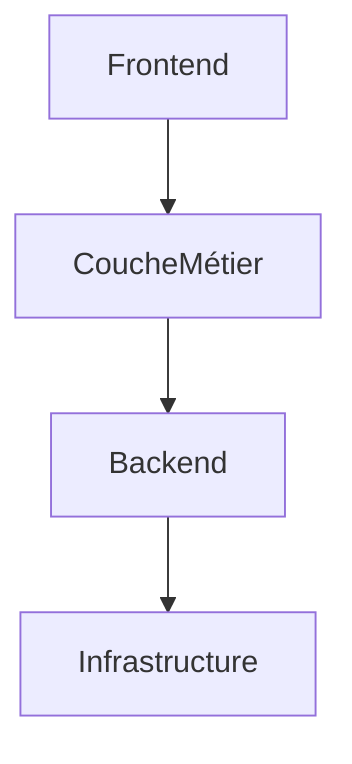

# Architectures logiciel 

Cette architecture est moins modulable que le MVC (qui n'est pas en soir une architecture en couche).

🌈 En MVC, une seule modification dans la base de données peut **être propagée à plusieurs vues** avec un minimum d'effort

## Architecture en couche



L'architecture en couches dans le domaine du Web est une approche de conception qui organise un système web en différentes **couches fonctionnelles**, chacune ayant des responsabilités spécifiques. 

Cette approche permet de séparer les préoccupations et de rendre le système plus modulaire, flexible et facile à maintenir.

🍅 Voici généralement les différentes couches que l'on retrouve dans une architecture en couches pour le Web, **exemple d'architecture multicouches **.

1. **Couche de présentation (Frontend)**
   
   - Cette couche gère l'interface utilisateur et l'interaction avec l'utilisateur.
   - Elle comprend généralement du code HTML, CSS et JavaScript.
   - Son rôle est de présenter les données de manière conviviale et interactive à l'utilisateur.
   - Les technologies courantes incluent les frameworks JavaScript tels que **React**, **Angular**, **Vue.js**, etc.

2. **Couche métier (Backend)** 
   
   - Cette couche gère la logique métier de l'application.
  
   - Elle traite les requêtes de l'utilisateur, accède aux données, effectue des opérations métier et retourne les résultats au client. Par exemple la vérification des données utilisateurs    
  
   - Elle peut être implémentée en utilisant différents langages de programmation tels que Java, Python, Node.js, etc.
  
   - Les frameworks web comme Django (Python), Spring (Java), Express (Node.js) sont souvent utilisés pour construire cette couche.

3. **Couche d'accès aux données (Backend)** 
   
   - Cette couche est responsable de l'accès et de la manipulation des données.
  
   - Elle communique avec les bases de données et d'autres sources de données externes.
  
   - Elle assure la persistance des données et fournit des fonctionnalités telles que la création, la lecture, la mise à jour et la suppression (CRUD).
  
   - Des technologies comme SQL, NoSQL, ORM (Object-Relational Mapping) sont utilisées pour interagir avec les bases de données.

4. **Couche d'infrastructure** 
   
   - Cette couche fournit les composants et services sous-jacents nécessaires au fonctionnement de l'application.
   - Elle peut inclure des serveurs web, des serveurs d'application, des services de gestion de la configuration, des services de sécurité, etc.
   - Elle assure la disponibilité, la fiabilité et la scalabilité du système.

🚀 **L'architecture en couches** permet une **séparation** claire des responsabilités, ce qui facilite la gestion, la maintenance et l'évolution de l'application web. 

🚀 Chaque couche peut être développée, **testée** et **déployée** indépendamment des autres, ce qui favorise la collaboration entre les équipes et la réutilisation des composants.

⚠️ Mais chaque couche est dépendante des autres couches.

## Exemple d'architecture en couche

- 🥦 Structure de l'application

```
myApp/
├── controllers/
│   └── userController.js
├── services/
│   └── userService.js
├── repositories/
│   └── userRepository.js
└── models/
    └── User.js
```

### Description des Couches :

1. **Contrôleurs :**
   - Les contrôleurs dépendent des services pour la logique métier et utilisent les services pour traiter les requêtes et renvoyer les réponses aux clients.

1. **Services :**
   - Les services dépendent des référentiels pour accéder aux données et effectuer les opérations CRUD. Ils encapsulent la logique métier de manière à ce qu'elle puisse être réutilisée dans toute l'application.

1. **Référentiels (Repositories) :**
   - Les référentiels dépendent des modèles pour définir la structure des données et accéder aux données dans la base de données.

1. **Modèles :**
   - Les modèles définissent la structure des données de l'application et sont utilisés par les référentiels pour accéder aux données dans la base de données.

### 🍰 Code :

1. **userController.js :**
```js
const userService = require('../services/userService');

exports.getAllUsers = (req, res) => {
    userService.getAllUsers()
        .then(users => res.json(users))
        .catch(err => res.status(500).json({ message: err.message }));
};

exports.createUser = (req, res) => {
    const userData = req.body;
    userService.createUser(userData)
        .then(user => res.status(201).json(user))
        .catch(err => res.status(400).json({ message: err.message }));
};
```

2. **userService.js :**
```js
const userRepository = require('../repositories/userRepository');

exports.getAllUsers = () => {
    return userRepository.getAllUsers();
};

exports.createUser = (userData) => {
    return userRepository.createUser(userData);
};
```

3. **userRepository.js :**
```js
const User = require('../models/User');

exports.getAllUsers = () => {
    return User.find().exec();
};

exports.createUser = (userData) => {
    const newUser = new User(userData);
    return newUser.save();
};
```

4. **User.js :**
```js
const mongoose = require('mongoose');

const userSchema = new mongoose.Schema({
    name: String,
    email: String,
    // Autres champs...
});

module.exports = mongoose.model('User', userSchema);
```

⚠️ Chaque couche dépend **directement** de la couche immédiatement inférieure :

- Les contrôleurs dépendent des services pour accéder à la logique métier.
- Les services dépendent des référentiels pour accéder aux données.
- Les référentiels dépendent des modèles pour définir la structure des données et accéder aux données dans la base de données.


## Un exemple en PHP

La couche de présentation communique avec la couche métier pour récupérer et afficher les données des livres, ainsi que pour ajouter un nouveau livre. La couche métier à son tour communique avec la couche d'accès aux données pour effectuer les opérations sur les livres. Cette approche permet une séparation claire des responsabilités et une meilleure modularité de l'application.

1. **Couche de présentation (UI)** : Cette couche gère l'interface utilisateur et communique avec la couche métier pour récupérer et afficher les données.

```php
<?php
include 'BusinessLogic.php';

$library = new BusinessLogic();

// Affichage des livres
$books = $library->getAllBooks();
foreach ($books as $book) {
    echo $book['title'] . " par " . $book['author'] . "<br>";
}

// Ajout d'un nouveau livre
$library->addBook("Nouveau livre", "Nouvel auteur");
?>
```

2. **Couche métier (BusinessLogic)** : Cette couche contient la logique métier de l'application, telle que la manipulation des données et les règles métier.

```php
<?php
include 'DataAccess.php';

class BusinessLogic {
    private $dataAccess;

    public function __construct() {
        $this->dataAccess = new DataAccess();
    }

    public function getAllBooks() {
        return $this->dataAccess->getAllBooks();
    }

    public function addBook($title, $author) {
        $this->dataAccess->addBook($title, $author);
    }
}
?>
```

3. **Couche d'accès aux données (DataAccess)** : Cette couche est responsable de l'accès aux données, telles que les opérations de lecture et d'écriture dans une base de données.

```php
<?php
class DataAccess {
    private $books = [];

    public function __construct() {
        // Initialisation avec quelques livres par défaut
        $this->books = [
            ['title' => 'Livre 1', 'author' => 'Auteur 1'],
            ['title' => 'Livre 2', 'author' => 'Auteur 2'],
            ['title' => 'Livre 3', 'author' => 'Auteur 3']
        ];
    }

    public function getAllBooks() {
        return $this->books;
    }

    public function addBook($title, $author) {
        $newBook = ['title' => $title, 'author' => $author];
        array_push($this->books, $newBook);
    }
}
?>
```
