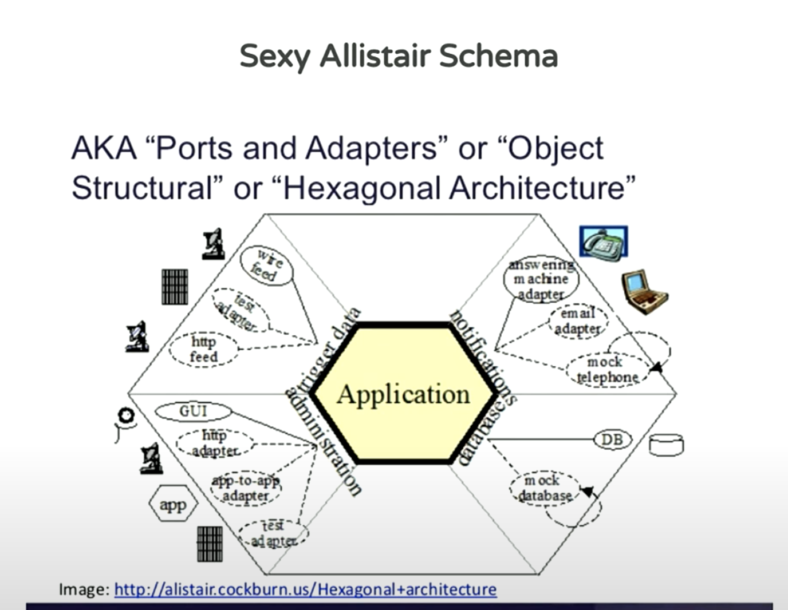

# Architecture Hexagonale

L'architecture hexagonale, également connue sous le nom d'architecture en ports et adaptateurs, a été **conceptualisée** par **Alistair Cockburn** dans les années 2000. 

Cockburn est un informaticien renommé, auteur, conférencier et consultant spécialisé dans les méthodes de développement logiciel et la gestion de projet. Il est également l'un des signataires du Manifeste Agile.



⚠️ L'architecture hexagonale n'est pas une architecture en couches au sens traditionnel du terme, mais elle partage certaines similitudes avec les architectures en couches dans la façon dont elle organise le code et les responsabilités.

⚠️ L'architecture hexagonale met explicitement l'accent sur l'indépendance des frameworks.

⚠️ Elle organise le code autour des concepts de ports et d'adaptateurs.

Cela signifie que même si une implémentation spécifique utilise des frameworks, le cœur de l'application (le domaine métier) **est indépendant de ces détails d'implémentation**. 

⚠️ C'est l'une des principales distinctions entre l'architecture hexagonale et les autres approches architecturales.

Dans une architecture en couches classique, les différentes parties de l'application sont organisées en couches distinctes, généralement de bas niveau à haut niveau, telles que la couche de données, la couche métier et la couche de présentation. 
Chaque couche a ses propres responsabilités et communique avec les couches adjacentes.

Dans l'architecture hexagonale, l'organisation du code est basée sur une approche centrée sur le domaine. 

L'architecture hexagonale est un style architectural qui met l'accent sur la **modularité**, la **flexibilité** et la **facilité de maintenance** des systèmes logiciels. 

Elle repose sur plusieurs concepts clés :

1. **Hexagone** : L'idée principale est de représenter l'application comme un hexagone, avec des ports entrants et sortants pour communiquer avec le monde extérieur. Ces ports sont des points d'entrée et de sortie pour les données et les commandes.

2. **Domaine métier central** : Au cœur de l'hexagone se trouve le domaine métier de l'application. C'est là que résident les règles métier et la logique de traitement des données.

3. **Ports et adaptateurs** : Les ports permettent à l'application de communiquer avec des éléments externes tels que les bases de données, les interfaces utilisateur, les services web, etc. Les adaptateurs convertissent les données externes pour les rendre compatibles avec le format interne de l'application, et vice versa.

4. **Indépendance des frameworks** : L'architecture hexagonale favorise l'indépendance vis-à-vis des frameworks. Cela signifie que le cœur de l'application n'est pas directement lié à un framework spécifique, ce qui rend l'application plus portable et plus facile à maintenir.

5. **Testabilité** : En séparant clairement le domaine métier du reste de l'application, l'architecture hexagonale facilite les tests unitaires et les tests d'intégration. Les composants peuvent être testés de manière isolée sans avoir besoin de l'infrastructure externe.

6. **Evolutivité** : Grâce à sa modularité, l'architecture hexagonale facilite l'évolution de l'application au fil du temps. Les nouvelles fonctionnalités peuvent être ajoutées en développant de nouveaux ports et adaptateurs sans perturber le cœur de l'application.

## Exemple architecture Hexagonale

```
src/
├── adapters/
│   ├── http/
│   │   ├── controllers/
│   │   ├── routes/
│   │   └── middleware/
│   └── socket/
├── application/
├── domain/
│   ├── entities/
│   ├── repositories/
│   └── services/
└── infrastructure/
    ├── database/
    ├── cache/
    └── logging/

app.ts
package.json
tsconfig.json
```

- Le répertoire `adapters` contient les adaptateurs pour les différentes interfaces utilisateur (HTTP, sockets, etc.).
- `application` contient la logique d'application, qui utilise le domaine pour fournir des fonctionnalités spécifiques.
- `domain` contient la logique métier principale de l'application, avec des entités, des repositories et des services métier.
- `infrastructure` contient les détails de l'implémentation, tels que la configuration de la base de données, le cache et le logging.

La distinction entre `domain` et `application` est clarifiée : `domain` représente la logique métier tandis que `application` représente l'utilisation de cette logique pour fournir des fonctionnalités spécifiques à l'application.

